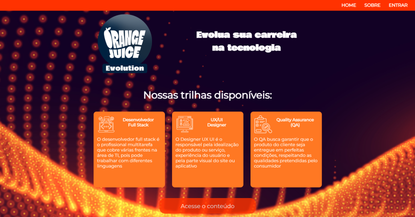

<h1>Orange Evolution - Squad30</h1> 

  

  
  
   
  
  

> Status do Projeto:  Em Desenvolvimento :warning:

### Tópicos 

:small_blue_diamond: [Descrição do projeto](#descrição-do-projeto-page_with_curl)

:small_blue_diamond: [Funcionalidades](#funcionalidades-heavy_check_mark)

:small_blue_diamond: [Funcionalidades em aberto](#funcionalidades-em-aberto-warning)

:small_blue_diamond: [Deploy da Aplicação](#deploy-da-aplicação-dash)

:small_blue_diamond: [Pré-requisitos](#pré-requisitos-ok)

:small_blue_diamond: [Como rodar a aplicação](#como-rodar-a-aplicação-arrow_forward)

:small_blue_diamond: [Casos de uso](#casos-de-uso-arrow_forward)

:small_blue_diamond: [Dependencias e tecnologias](#dependencias-e-tecnologias-computer)

:small_blue_diamond: [Desenvolvedores e contribuintes](#desenvolvedores-e-contribuintes-octocat) 

:small_blue_diamond: [Licença](#licença-trophy)

... 

## Descrição do projeto :page_with_curl: 

  Projeto desenvolvido na Hackathon do Programa de Formação Season 4 da FCamara. A aplicação é uma plataforma de estudos que contribui na formação de profissionais, a Orange Evolution. Onde alunos cadastrados tem acesso a conteúdos gratuitos de uma forma intuitiva e personalizável. 

## Funcionalidades :heavy_check_mark:

- [X] Cadastro de usuários
- [X] Login de usuários com conteúdo personalizado de acordo com a trilha escolhida
- [X] Barra de progresso que permite o acompanhamento dos conteudos estudados 
- [X] Edição do perfil do usuário
- [X] Permite que o administrador adcione e exclua os conteudos das trilhas
- [X] Conteúdo atualizado dinamicamente
- [X] Alteração de layout de forma dinâmica através da responsividade

## Funcionalidades em aberto :warning:

- [ ] Cadastro de novos administradores
- [ ] Barra de pesquisa de conteúdo filtrado por: área, autor, tipo
- [ ] Certificado Digital de Segurança
- [ ] Elementos de interação social com área de comentários e curtidas

## Deploy da Aplicação :dash:

> http://orangeevolution-squad30.up.railway.app/

... 

## Pré-requisitos :ok:

[Node](https://nodejs.org/en/download/) :warning: 

...

## Dependencias e tecnologias :computer:

- [NODE](https://nodejs.org/en/)
- [EXPRESS](https://expressjs.com/pt-br/)
- [SQLITE](https://www.sqlite.org/index.html)
- [jsonwebtoken](https://www.npmjs.com/package/jsonwebtoken)
- [cors](https://www.npmjs.com/package/cors)
- [dotenv](https://www.npmjs.com/package/dotenv)

